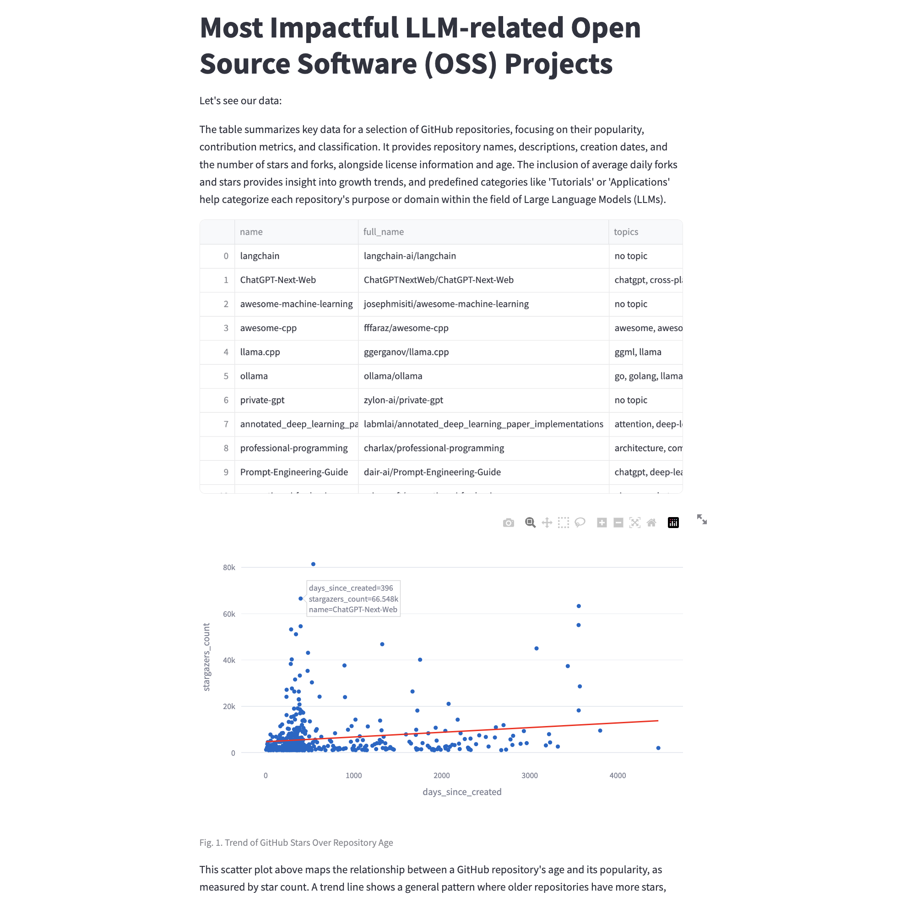
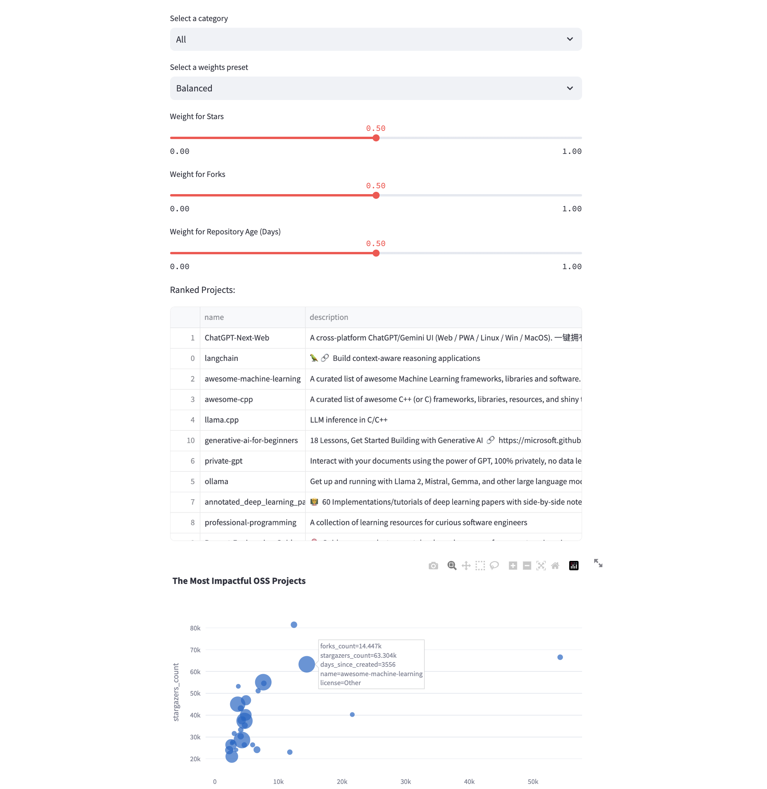

# Most Impactful LLM-related Open Source Software (OSS) Projects

This repository contains a Streamlit application that analyzes and visualizes data on GitHub repositories related to Large Language Models (LLMs). The app provides insights into the popularity and growth trends of these repositories.






## Repository Structure

```
DS-ML-CHALLENGE-SZAFRANSKIFILIP/
├── .venv/
├── data/
│   ├── github_final.csv
│   ├── github_repos_data.csv
│   └── sample-data.csv
├── notebooks/
│   ├── 001_Data collection_cleaning.ipynb
│   ├── 002_Feature_engineering.ipynb
│   ├── 003_Visualizations_Stats.ipynb
│   └── 004_ML models.ipynb
├── streamlit/
│   └── app.py
├── fetch-data.py
├── pyproject.toml
└── sample-data.csv
```

## Getting Started

### Prerequisites

- Python 3.8 or higher
- Poetry (for dependency management)

### Installation

1. **Clone the repository:**

   ```sh
    cd path/to/your/directory

    git clone https://github.com/szafranskifilip/LLM-open-source-project-analysis.git
   ```

2. **Install dependencies using Poetry:**

   ```sh
   poetry install
   ```

3. **Activate the virtual environment:**

   ```sh
   poetry shell
   ```

### Running the Streamlit App

1. **Navigate to the `streamlit` directory:**

   ```sh
   cd streamlit
   ```

2. **Run the Streamlit app:**

   ```sh
   streamlit run app.py
   ```

3. **Open the app in your web browser:**

   After running the above command, Streamlit will provide a local URL (usually `http://localhost:8501`). Open this URL in your web browser to view the app.

## Features

- **Data Overview**: Displays a table with key metrics of GitHub repositories.
- **Scatter Plot**: Shows the relationship between repository age and star count with a trend line.
- **Timeline Visualization**: Depicts the growth in the number of repositories over time.
- **License Distribution**: Provides a pie chart of the most common licenses in the dataset.
- **Impactful Projects**: Allows users to interactively determine the most impactful projects based on various metrics.

## Data

The primary data file used by the app is `data/github_final.csv`, which includes the following columns:

- `name`: Name of the repository
- `description`: Description of the repository
- `created_at`: Creation date of the repository
- `stargazers_count`: Number of stars the repository has
- `forks_count`: Number of forks the repository has
- `license`: License type of the repository
- `days_since_created`: Age of the repository in days
- `categories`: Categories to which the repository belongs (engineered using LLM)

### Category Engineering

The `categories` column was engineered using a Large Language Model (LLM) with the OpenAI API. The process involved extracting relevant category information from the repository descriptions. The categories include:

- Tutorials
- Applications
- AI engineering
- Model development
- Model repo
- Infrastructure
- Lists
- Unknown

The script for category assignment is as follows:

```python
import os
import pandas as pd
from pydantic import BaseModel, Field
from langchain import ChatOpenAI, ChatPromptTemplate

# Load OpenAI API key from the environment variables
OPENAI_API_KEY = os.environ.get('OPENAI_API_KEY')

def assign_category(inp: str) -> str:
    if inp is None or pd.isna(inp):
        return "Unknown"
    
    tagging_prompt = ChatPromptTemplate.from_template(
        """
        Extract the desired information from the following passage.

        Only extract the properties mentioned in the 'Classification' function.

        Passage:
        {input}
        """
    )

    class Classification(BaseModel):
        category: str = Field(description="The category of the text.", 
                              enum=['Tutorials', 'Applications', 'AI engineering', 'Model development', 'Model repo', 'Infrastructure', 'Lists'])

    # LLM
    llm = ChatOpenAI(temperature=0, model="gpt-3.5-turbo-0125").with_structured_output(
        Classification
    )

    tagging_chain = tagging_prompt | llm
    results = tagging_chain.invoke({"input": inp})
    return results.category
```

## Notebooks

The `notebooks` directory contains Jupyter notebooks used for data collection, cleaning, feature engineering, visualization, and machine learning model development.

## Contact

For any questions or suggestions, please open an issue or contact the repository owner.

## License

This project is licensed under the MIT License. See the `LICENSE` file for more details.
